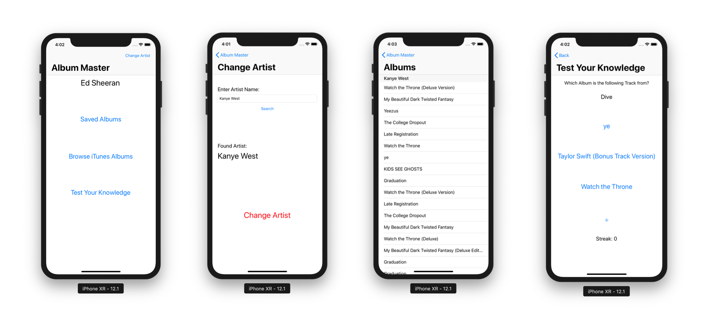
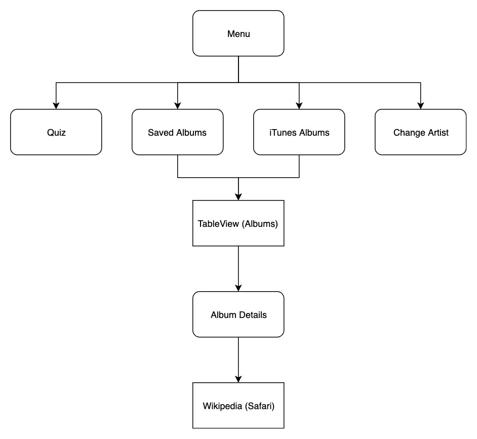
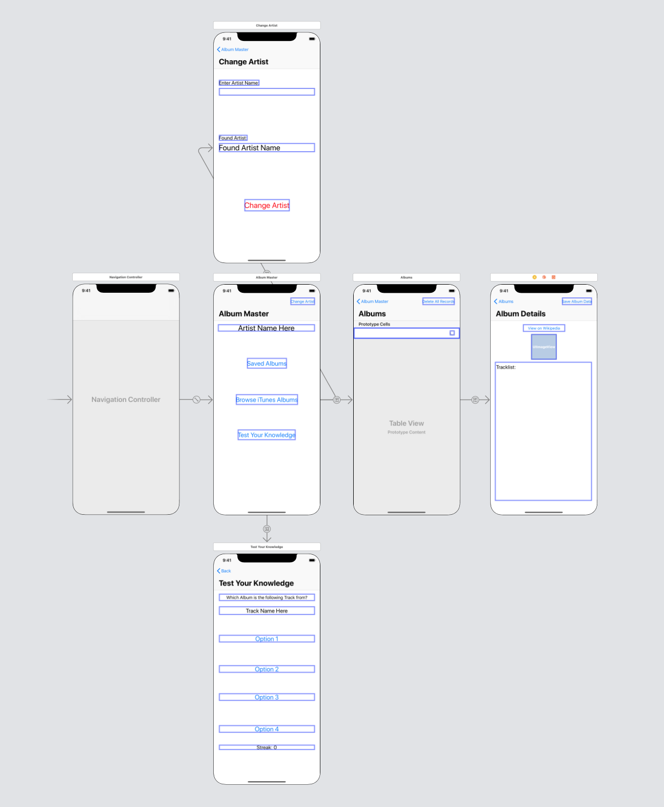
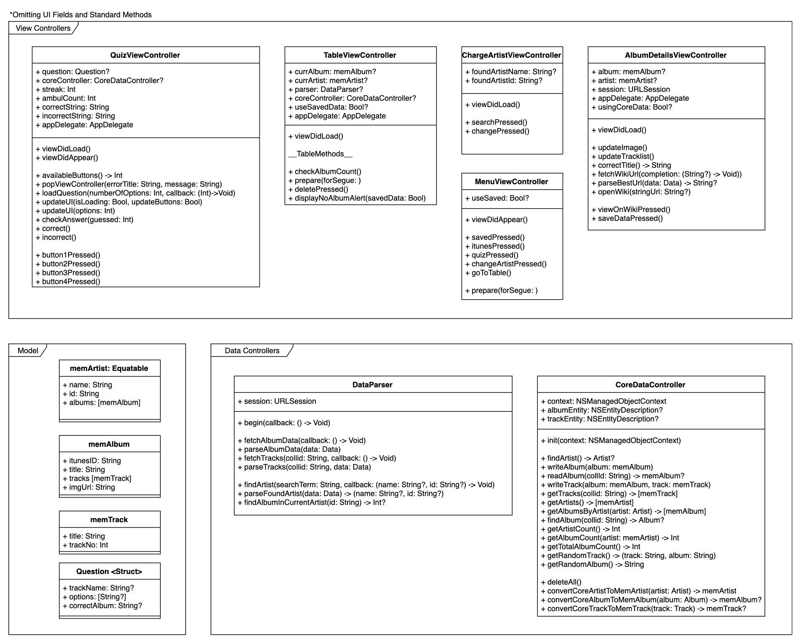
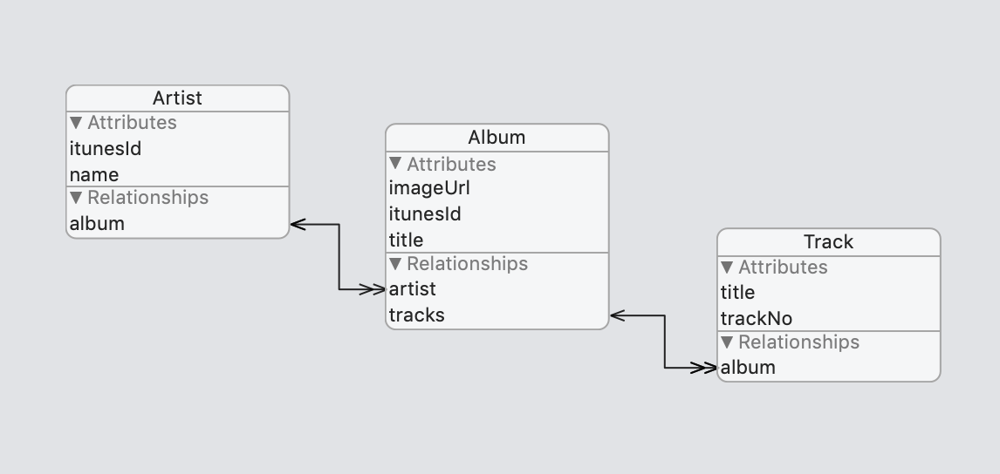

# Album Master

*Imported from GitHub Classroom*

Using the iTunes Search API become a master at Music Album knowledge.

Gather your personalised collection of favourite albums and quiz yourself on which tracks are from which album!

### Objective

The objective of this app is to create a non-trivial app for my 'Creating Data Driven Mobile Applications' unit at Swinburne University of Technology.

### Features

- Search for albums using the iTunes Search API
- Save album data to the device
- Quiz yourself on randomly generated questions
- Browse the most relevant Wikipedia article for the album

### Design Diagrams

#### Navigation

Navigation map showing how each screen can be accessed 

Navigation UI Map

#### Class Diagrams

Every class used to create Trackie. Most overridden system methods ignored

#### Data Model

Relational data model on how Artists, Albums and Tracks are stored

